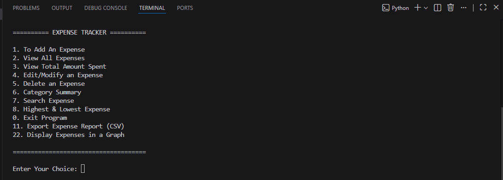
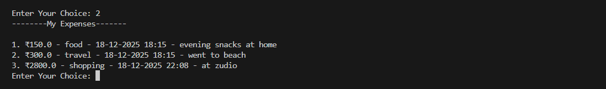
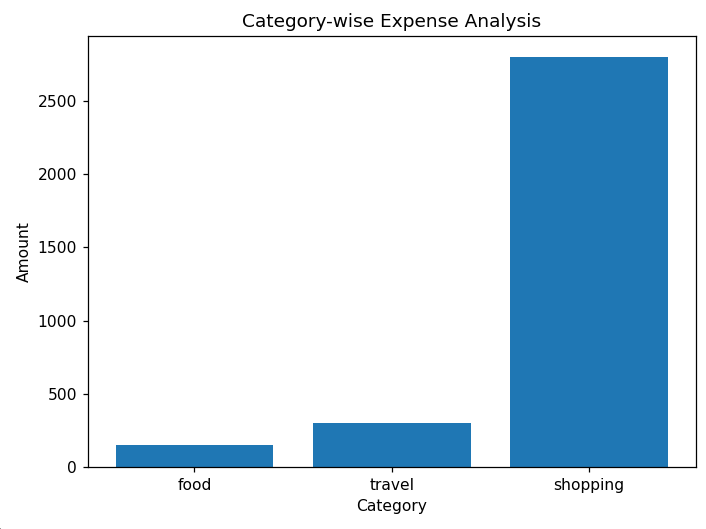

# Expense Tracker (Python)

## 📌 Overview

Expense Tracker is a command-line Python application that helps users record, manage, and analyze their daily expenses.
The project emphasizes clean code structure, modular design, and persistent data storage, along with basic data analysis and visualization.

This project is built as a learning-focused but practical application, demonstrating how real-world programs handle user input, data storage, analysis, and reporting.

It is suitable for beginner to intermediate Python learners.

---

## 🚀 Features

### Core Features

* Add a new expense (amount, category, date, note)
* View all recorded expenses
* Edit or delete existing expenses
* Persistent storage using JSON

### Analysis Features

* View total amount spent
* Category-wise expense summary
* Identify highest and lowest expenses
* Search expenses by keyword or date range

### Advanced Features

* Export expense data to CSV
* Category-wise expense visualization using Matplotlib
* Graceful handling of invalid input and empty data

---

## 🛠 Technologies Used

* **Python 3**
* **JSON** for data storage
* **CSV** for report export
* **Matplotlib** for data visualization

---

## 📂 Project Structure

```text
expense_tracker/
├── main.py              # Application entry point and menu handling
├── expense_ops.py       # CRUD operations (add, edit, delete, view)
├── analysis.py          # Expense analysis, graphs, and CSV export
├── storage.py           # JSON load/save utility functions
├── expenses.json        # Stored expense data
├── expense_report.csv   # Exported CSV report
├── screenshots/         # Application screenshots (README visuals)
│   ├── menu.png
│   ├── expenses.png
│   └── graph.png
├── .gitignore           # Files/folders ignored by Git
├── README.md            # Project documentation

```

---

## ▶ How to Run the Project

1. Clone or download the repository
2. Open the project folder in VS Code
3. Ensure Python is installed and configured
4. Install required dependency:

     — pip install matplotlib

5. Run the application:

     — python main.py

---

## 📊 Sample Output

### Terminal Output

```
1. ₹150.0 - food - 18-12-2025 18:15 - evening snacks at home
2. ₹300.0 - travel - 18-12-2025 18:15 - went to beach

```
## 📸 Screenshots

### Main Menu


### Expense List


### Category-wise Graph


## Graph Output

* Category-wise bar chart showing spending distribution

---

## ✅ Learning Outcomes

* Modular Python programming
* Working with files (JSON & CSV)
* Data aggregation and analysis
* Basic data visualization
* Writing clean, maintainable code

---

## 🔮 Future Improvements

* Monthly and yearly summary graphs
* GUI using Tkinter or PyQt
* Database integration (SQLite)
* User authentication

---

## 👤 Author

**Teja.P**
B.Sc Student | Python Developer (Beginner–Intermediate)

---

## 📄 License

Designed as a practical learning project demonstrating real-world Python concepts.
